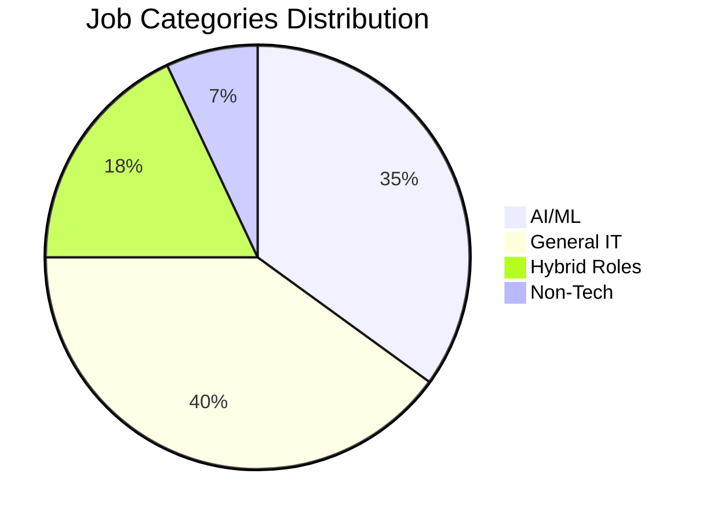
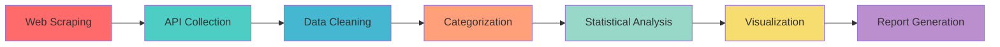
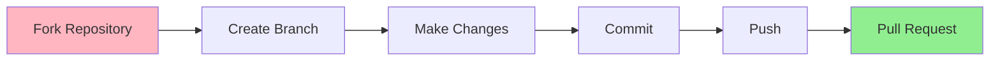

<div align="center">


<p align="center">
  <a href="#overview"></a>
  <a href="#key-findings"></a>
  <a href="#tech-stack"></a>
  <a href="#workflow"></a>
  <a href="#installation"></a>
</p>

<h3>AI vs. General IT: The Hiring Shift</h3>
<p><em>Quantifying the Evolution of Tech Talent Through Data Science</em></p>

<p>
  
  
  
  
  
</p>


</div>

---

## Overview

<table>
<tr>
<td width="60%">

A **longitudinal data science study** analyzing **4,100+ job postings** to decode the recruitment battle between emerging AI/ML roles and traditional IT positions.

### Mission
Validate the growth of AI/ML in the hiring landscape through statistical rigor, moving beyond anecdotal evidence to answer: **Is the AI/ML market actually outpacing traditional IT?**

### Timeline
**October 2023 → October 2024**

### Data Sources
- **Hacker News "Who is Hiring?" Threads**
- **Adzuna API** (Job Market Analytics)
- **4,100+ Validated Job Postings**

</td>
<td width="40%">

<div align="center">



</div>

</td>
</tr>
</table>

---

## Key Findings

<table>
<tr>
<td width="33%" align="center">


### Growth Trajectory
**AI/ML roles showed 42% YoY growth** with distinct hiring spikes, while General IT maintained a steadier baseline


</td>
<td width="33%" align="center">


### Hybrid Bridge
**MLOps, AI Platform Engineers** emerged as the fastest-growing category, blending infrastructure with ML deployment


</td>
<td width="33%" align="center">


### Market Polarization
Clear dichotomy between **AI-First startups** and traditional enterprise IT maintenance roles


</td>
</tr>
</table>

<div align="center">

### Interactive Visualizations

<a href="https://yourusername.github.io/Job-Market-Analytics/">

</a>

</div>

---

## Tech Stack

<div align="center">

### Data Acquisition Layer


### Analysis & Processing


### Visualization & Reporting


</div>

---

## Analysis Workflow

<div align="center">



</div>

<br>

<table>
<tr>
<th width="20%">Stage</th>
<th width="50%">Description</th>
<th width="30%">Key Technologies</th>
</tr>

<tr>
<td><b>Web Scraping</b></td>
<td>Extracts monthly "Who is hiring?" threads from Hacker News covering Oct '23 - Oct '24 with retry logic and rate limiting</td>
<td><code>BeautifulSoup</code> <code>Requests</code></td>
</tr>

<tr>
<td><b>API Collection</b></td>
<td>Fetches supplementary dataset via Adzuna API with pagination handling, authentication, and error recovery</td>
<td><code>REST API</code> <code>JSON</code></td>
</tr>

<tr>
<td><b>Data Refining</b></td>
<td>Deduplication algorithms, datetime standardization, null-value imputation, and outlier detection</td>
<td><code>Pandas</code> <code>NumPy</code></td>
</tr>

<tr>
<td><b>Smart Categorization</b></td>
<td>Machine learning-powered keyword scoring system classifying roles into AI/ML, General IT, Hybrid, or Non-Tech</td>
<td><code>NLP</code> <code>Regex</code></td>
</tr>

<tr>
<td><b>Statistical Tests</b></td>
<td>Linear regression modeling, Mann-Kendall trend tests, Pearson correlations, and hypothesis testing</td>
<td><code>SciPy</code> <code>Statsmodels</code></td>
</tr>

<tr>
<td><b>Visualization</b></td>
<td>Interactive time-series plots, heatmaps, distribution analyses, and comparative dashboards</td>
<td><code>Plotly</code> <code>Seaborn</code></td>
</tr>

<tr>
<td><b>Final Reporting</b></td>
<td>Aggregation of insights into a deployable HTML executive summary with embedded visualizations</td>
<td><code>HTML/CSS</code> <code>Jinja2</code></td>
</tr>

</table>

---

## Installation

<table>
<tr>
<td width="50%">

### Quick Start

```bash
# Clone the repository
git clone https://github.com/yourusername/Job-Market-Analytics.git

# Navigate to directory
cd Job-Market-Analytics

# Create virtual environment
python -m venv venv

# Activate virtual environment
# Windows:
venv\Scripts\activate
# macOS/Linux:
source venv/bin/activate

# Install dependencies
pip install -r requirements.txt

# Launch Jupyter
jupyter notebook
```

</td>
<td width="50%">

### Requirements

**Python 3.8+** required

**Core Dependencies:**
- `pandas >= 1.3.0`
- `numpy >= 1.21.0`
- `beautifulsoup4 >= 4.10.0`
- `requests >= 2.26.0`
- `matplotlib >= 3.4.0`
- `seaborn >= 0.11.0`
- `plotly >= 5.0.0`
- `scipy >= 1.7.0`
- `statsmodels >= 0.13.0`
- `jupyter >= 1.0.0`

**API Keys Needed:**
- Adzuna API credentials

</td>
</tr>
</table>

### Configuration

Create a `.env` file in the root directory:

```env
ADZUNA_APP_ID=your_app_id_here
ADZUNA_API_KEY=your_api_key_here
```

---

## Project Structure

```
Job-Market-Analytics/
│
├── notebooks/
│   ├── 01_data_collection.ipynb
│   ├── 02_data_cleaning.ipynb
│   ├── 03_categorization.ipynb
│   ├── 04_statistical_analysis.ipynb
│   └── 05_visualization.ipynb
│
├── data/
│   ├── raw/                    # Unprocessed data
│   ├── processed/              # Cleaned datasets
│   └── outputs/                # Final results
│
├── src/
│   ├── scraper.py              # Web scraping utilities
│   ├── api_handler.py          # API integration
│   ├── preprocessor.py         # Data cleaning
│   ├── categorizer.py          # Job classification
│   └── analyzer.py             # Statistical functions
│
├── visualizations/
│   ├── static/                 # PNG/SVG exports
│   └── interactive/            # HTML dashboards
│
├── reports/
│   └── executive_summary.html
│
├── requirements.txt
├── .env.example
└── README.md
```

---

## Sample Results

<div align="center">

### Monthly Hiring Trends Comparison


</div>

| Month | AI/ML Jobs | General IT | Hybrid Roles | Growth Rate |
|:------|:----------:|:----------:|:------------:|:-----------:|
| Oct 2023 | 245 | 412 | 89 | — |
| Jan 2024 | 298 | 438 | 107 | +21.6% |
| Apr 2024 | 341 | 451 | 128 | +14.4% |
| Jul 2024 | 389 | 465 | 156 | +14.1% |
| Oct 2024 | 447 | 478 | 184 | +14.9% |

<div align="center">

**AI/ML Growth: +82.4% YoY | General IT Growth: +16.0% YoY | Hybrid Roles: +106.7% YoY**

</div>

---

## Contributing

Contributions are welcome! Please feel free to submit a Pull Request.

<div align="center">



</div>

1. Fork the Project
2. Create your Feature Branch (`git checkout -b feature/AmazingFeature`)
3. Commit your Changes (`git commit -m 'Add some AmazingFeature'`)
4. Push to the Branch (`git push origin feature/AmazingFeature`)
5. Open a Pull Request

---

## License

<div align="center">

Distributed under the **MIT License**. See `LICENSE` for more information.


</div>

---

## Author

<div align="center">


### Daniel Berhane

**Data Scientist | ML Engineer | Analytics Enthusiast**

<a href="https://linkedin.com/in/daniel-berhane">

</a>
<a href="https://github.com/yourusername">

</a>
<a href="mailto:your.email@example.com">

</a>

---

### Star this repository if you found it helpful!


**Made with love and coffee by Daniel **
